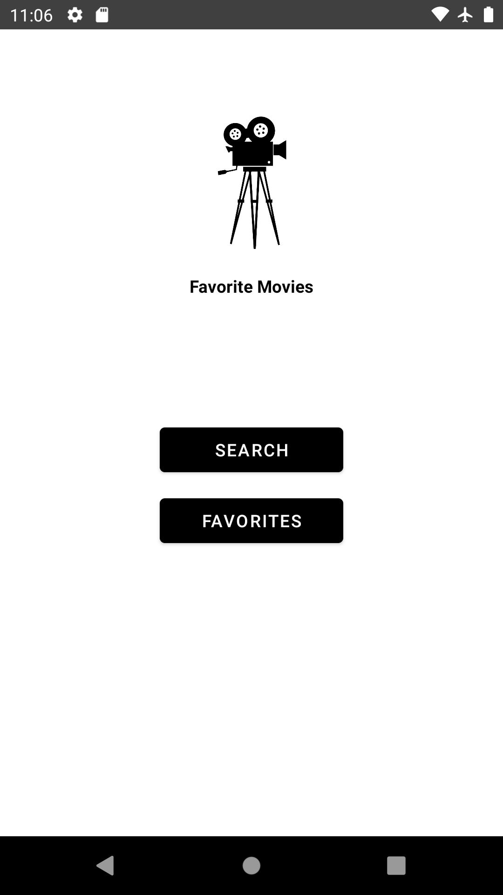
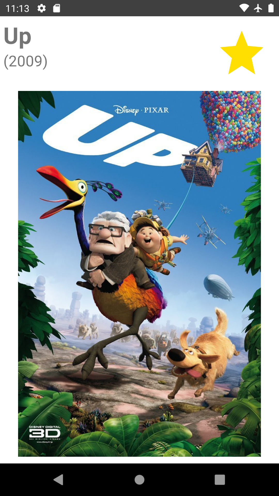

# FavoriteBooks

This is a Kotlin Android App for searching movies and series from the imdb Database and saving them to your favorites. Used technologies in this project are Room, Retrofit, Gson and MVVM.

## Planned features:

- adding different lists like: watched or want to watch
- rework the design of the UI to look a bit nicer

## Sources that helped me building this App:

- Google Room with a view Codelab: https://developer.android.com/codelabs/android-room-with-a-view-kotlin#0
- Medium article for ViewModelFactory.Provider: https://medium.com/koderlabs/viewmodel-with-viewmodelprovider-factory-the-creator-of-viewmodel-8fabfec1aa4f
- Mike Johnston with Room and collecting coroutine data: https://www.youtube.com/user/355MrBean

## Screenshots:

